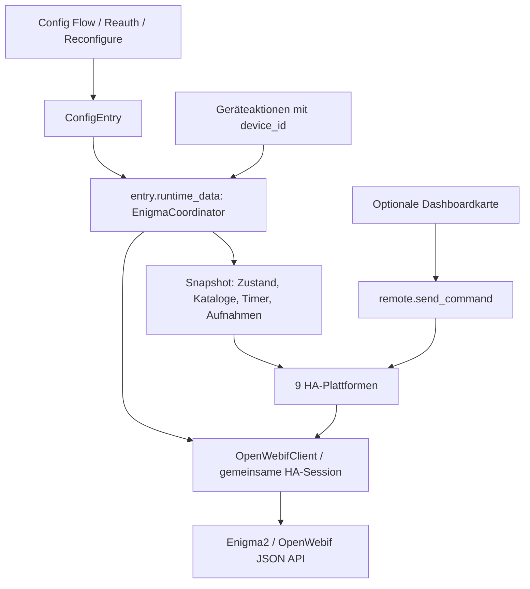

# Architektur und aktuelle Home-Assistant-Vorgaben

Quellenstand: 12.09.2026; ausführbare Zielprüfung mit Home Assistant 2026.9.1.

## Datenfluss

## Zuständigkeiten

| Modul | Verantwortung |
| --- | --- |
| `api.py` | HTTP/Auth/TLS/Timeout, JSON- und Bildprüfung, Befehlsfehler, Lock für Mutationen |
| `models.py` | HA-unabhängige Datenklassen, Boolean-/Zahlen-Normalisierung, IDs, Senderkatalog und Zeitvalidierung |
| `coordinator.py` | Einmalige Geräteabfrage, gemeinsame Pollzyklen, Fehlerklassifizierung, Katalogwechsel |
| `entity.py` | Gemeinsame Geräteidentität und Verfügbarkeit |
| `config_flow.py` | Validierung vor Einrichtung, Dubletten, Zugangsdaten, Reauth, Reconfigure und Optionen |
| `services.py` | Gerätebezogene Aktionen; Zielauflösung und fachliche Validierung |
| Plattformmodule | Übersetzen vorhandener Daten und HA-Aktionen; keine eigenen Status-Pollschleifen |
| `diagnostics.py` | Ausschließlich technische Anzahlen und Abrufstatus |
| `www/` | Optionales Frontend ohne Receiver-Verbindung oder eigene Zugangsdaten |

Das Manifest deklariert `integration_type: device` und `iot_class: local_polling`.
Jeder Eintrag stellt genau einen Receiver dar. Der Client hängt nicht von HA ab,
liegt für die erste lokale Version aber im Komponentenpaket. Eine spätere Auslagerung
als versionierte Bibliothek ist möglich; derzeit ist keine zusätzliche Laufzeitabhängigkeit nötig.

## Anwendung der HA-Dokumentation

| Vorgabe und Quelle | Umsetzung |
| --- | --- |
| [Manifest](https://developers.home-assistant.io/docs/creating_integration_manifest/) | Eigenes Domain/Version, Config Flow, lokales Polling, Gerätetyp; keine erneute aiohttp-Abhängigkeit |
| [Config Flow](https://developers.home-assistant.io/docs/core/integration/config_flow/) | Verbindung und Gerät vor dem Anlegen prüfen; eindeutige MAC-basierte ID, Host-Fallback bei fehlender MAC; Reauth und Reconfigure |
| [Options Flow](https://developers.home-assistant.io/docs/core/integration/options_flow/) | `OptionsFlowWithReload`; vom Framework gesetzter Eintrag; automatische Übernahme durch Reload |
| [Runtime-Daten](https://developers.home-assistant.io/docs/core/integration-quality-scale/rules/runtime-data/) | Typisierter `ConfigEntry[EnigmaCoordinator]` statt frei strukturierter `hass.data`-Ablage |
| [Gemeinsames Abrufen](https://developers.home-assistant.io/docs/integration_fetching_data/) | `DataUpdateCoordinator`, erster Refresh vor Plattformaufbau, `_async_setup`, `always_update=False`, `CoordinatorEntity` |
| [Setup-Fehler](https://developers.home-assistant.io/docs/integration_setup_failures/) | Verbindungsprobleme führen zu Retry; Authentifizierungsprobleme zu `ConfigEntryAuthFailed` |
| [Aktionen](https://developers.home-assistant.io/docs/dev_101_services/) | Registrierung in `async_setup`; zwingendes Geräte-Ziel für Receiveraktionen; verständliche Ausnahmen; Felder/Übersetzungen |
| [Notify](https://developers.home-assistant.io/docs/core/entity/notify/) | Aktuelle `NotifyEntity` mit `async_send_message` und Titelunterstützung |
| [Medienplayer](https://developers.home-assistant.io/docs/core/entity/media-player/) | Implementierte Featureflags, Quellenliste, Medienbrowser, Abruf authentifizierter Bildbytes |
| [Kalender](https://developers.home-assistant.io/docs/core/entity/calendar/) | Zeitzonenbewusste sortierte Intervalle, Überschneidung statt nur Startzeitfilter, expandierte Wochenwiederholungen |
| [Qualitätsskala](https://developers.home-assistant.io/docs/core/integration-quality-scale/) | Anforderungen dienen als Prüfliste. Es wird keine Bronze-/Silber-/Gold-Stufe behauptet |

Die Integration nutzt bereits vorhandene Plattformaktionen: `remote.send_command`,
`media_player.*`, `notify.send_message`, `select.select_option`, `button.press` und
`camera.snapshot`. Eigene Duplikate wie `send_key`, `set_volume` und ein Screenshot-Service,
der nur Bytes verwirft, entfallen. Für timer-/gerätebezogene Sonderfunktionen gibt es
validierte Domain-Aktionen mit verpflichtendem `device_id`-Feld.

## Identität und Fehlerverhalten

Eine brauchbare MAC-Adresse aus den Interface-Daten identifiziert den Receiver;
MAC-Formatierung wird normalisiert, Null-/Broadcastadressen werden verworfen.
Ohne MAC dient ein normalisierter Hostname/IP als Fallback. Dieser ist nicht hardwarestabil;
bei späterem Adresswechsel bleibt der bestehende Eintrag über Reconfigure erhalten.
Ohne MAC kann die Integration einen Austausch hinter derselben Adresse nicht sicher erkennen.

Bei wichtigen Abfragen führen ungültige Antwortdaten zu einem fehlgeschlagenen Update.
Der letzte Snapshot bleibt intern erhalten, die Entitäten werden aber unavailable.
Ein Verbindungs-Binary-Sensor bleibt verfügbar und zeigt den Abrufzustand.

Optionale Signal-/EPG-Abfragen dürfen fehlen. Fehlgeschlagene Timer-/Aufnahmelisten
werden als `None` markiert und nicht mit „keine Timer/Aufnahmen“ verwechselt.
Bei Katalogfehlern werden keine veralteten Sender als bedienbare Liste angeboten.
Optionale Endpunkte werden später erneut versucht, Authfehler werden nie still geschluckt.

## Nebenläufigkeit und Last

Status, Signal und EPG teilen einen Pollzyklus; Listen besitzen längere Fristen.
Eine komplette Tastensequenz hält den Mutations-Lock, sodass parallel gestartete
Automationen ihre Tasten nicht vermischen. Alle Codes werden vor dem ersten Tastendruck
validiert. Ein Soll-Mute prüft innerhalb desselben Locks den Livezustand.

Bouquetwechsel und Polls verwenden einen zusätzlichen Daten-Lock. Die Senderliste wird
erst nach erfolgreichem Abruf atomar veröffentlicht. Damit kann weder ein verlorenes
Dispatcher-Ereignis noch ein gerade fertig werdender alter Poll den Wechsel überschreiben.

Die Kalenderexpansion verwendet die einstellbare Receiver-Zeitzone und behält bei
Wochenwiederholungen lokale Sendezeiten über den Sommerzeitwechsel hinweg bei.
Die HA-Standard-Zeitzone ist nur der Anfangswert. Sonderfälle nicht existierender bzw.
doppelter lokaler Uhrzeiten direkt im Umstellungsfenster müssen am konkreten Image
verifiziert werden; eine firmwareunabhängige Garantie gibt es dafür nicht.

## Zugriff und Veröffentlichung

HTTP Basic Auth bleibt im Request-Header. Generierte URLs enthalten keine von der
Integration hinzugefügten Zugangsdaten. Bilder werden serverseitig abgerufen.
Direkte Stream-URLs werden nicht als Entity-Attribute veröffentlicht; ein sicherer
Stream-Proxy wäre eine eigenständige Funktion mit Lebenszyklus und Ressourcenbegrenzung.

Diagnosen verwenden eine Allowlist statt nachträglicher Schwärzung beliebiger Rohdaten.
Die Integration protokolliert weder Nachrichteninhalte noch rohe API-Antworten.

Das öffentliche Ziel-Repository ist
[`topic2k/enigma2-connect`](https://github.com/topic2k/enigma2-connect). Manifest,
Codeowner und Issue-Tracker verweisen darauf. Hardwareabnahmen an zwei Receivern,
lokale Paketvorprüfung und Hassfest sind abgeschlossen. Die repositorybezogene
HACS-Aktion läuft erstmals nach dem Push auf GitHub.

