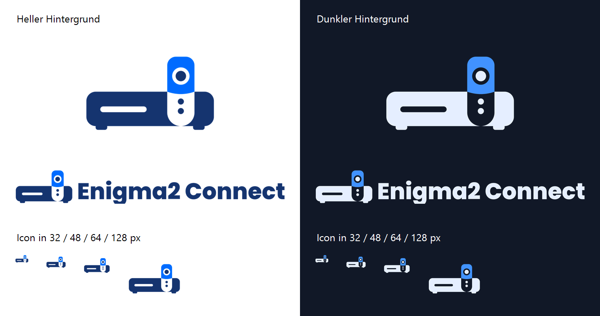
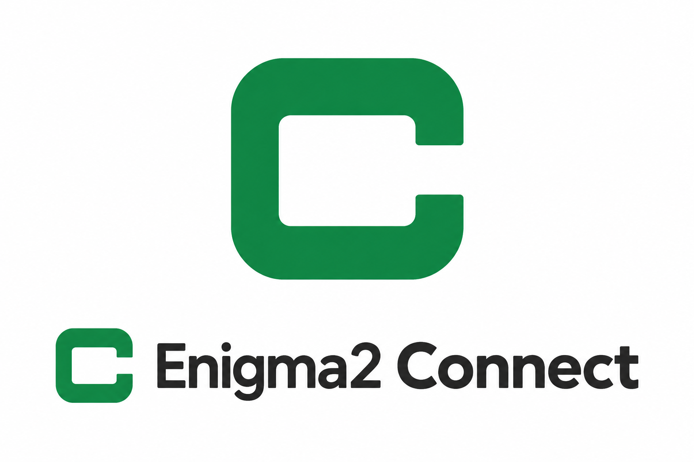
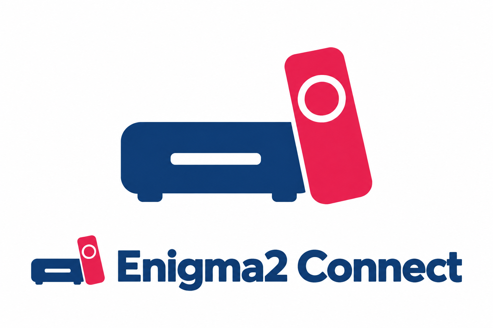
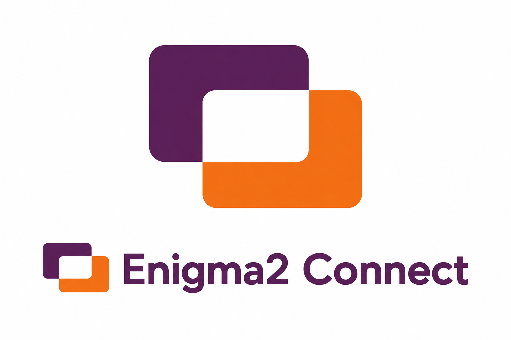
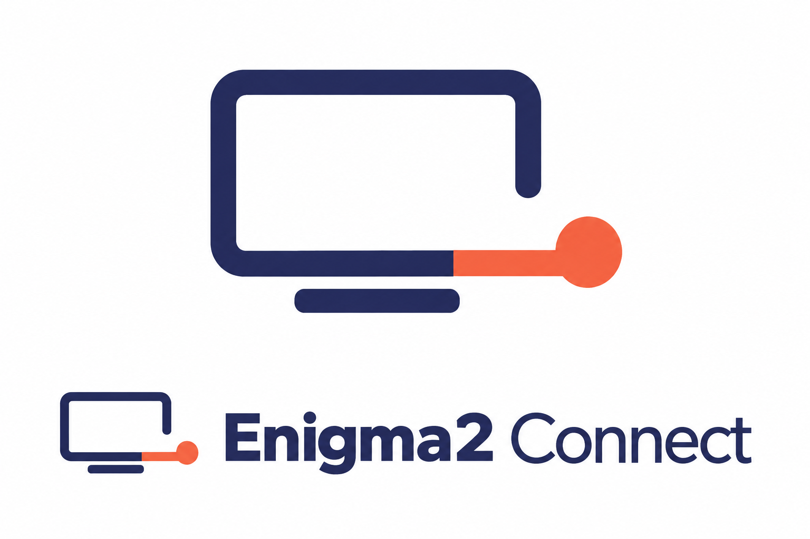
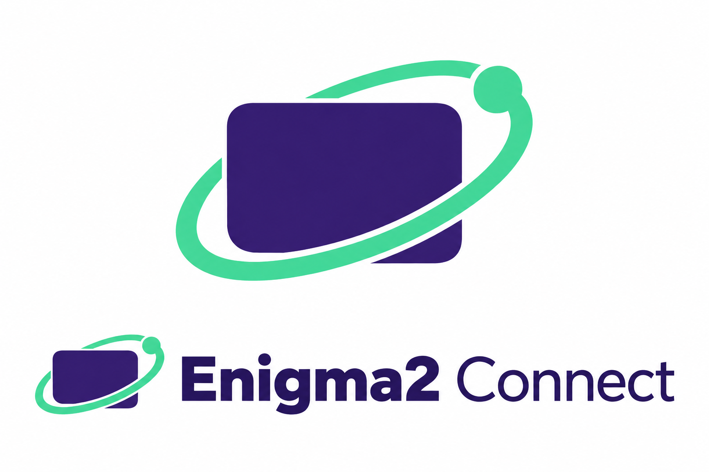
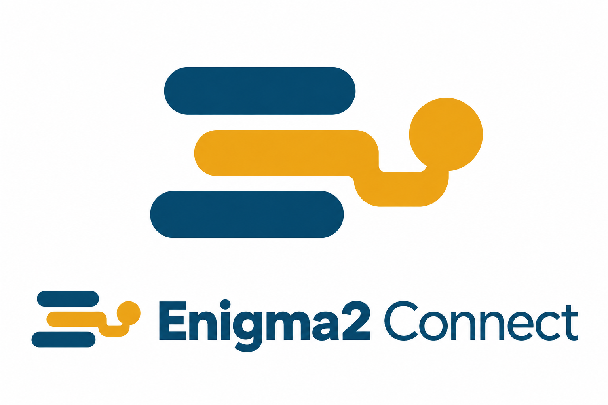

# Enigma2 Connect – Branding

## Ausgewählt: Integriert

Am 13. September 2026 wurde „Integriert“ aus Runde 4 als Branding für
Enigma2 Connect ausgewählt.

Das Motiv verbindet einen dunkelblauen Receiver mit einer aufrechten
Fernbedienung: Ihr weißer unterer Teil bildet eine Aussparung im Receiver,
der blaue Kopf ragt über dessen Oberkante hinaus. Die Wortmarke lautet
**Enigma2 Connect**.

Die Abbildung oben dokumentiert den freigegebenen Gestaltungsentwurf. Die fertigen Dateien folgen unten.

## Fertige Dateien

Die acht transparenten PNG-Dateien liegen direkt unter
[custom_components/enigma2_connect/brand](../../custom_components/enigma2_connect/brand/).
Home Assistant lädt lokale Dateien aus diesem Ordner seit Version 2026.3
ohne zusätzlichen Manifest-Eintrag; das Projekt setzt bereits Version 2026.9 voraus.
Sie werden beim Kopieren der Integration mitinstalliert.
[Offizielle Dokumentation](https://developers.home-assistant.io/blog/2026/02/24/brands-proxy-api/).

| Verwendung | Helle Oberfläche | Dunkle Oberfläche | Größe |
| --- | --- | --- | --- |
| Icon | [icon.png](../../custom_components/enigma2_connect/brand/icon.png) | [dark_icon.png](../../custom_components/enigma2_connect/brand/dark_icon.png) | 256 × 256 |
| Icon, hohe Auflösung | [icon@2x.png](../../custom_components/enigma2_connect/brand/icon@2x.png) | [dark_icon@2x.png](../../custom_components/enigma2_connect/brand/dark_icon@2x.png) | 512 × 512 |
| Wortmarke | [logo.png](../../custom_components/enigma2_connect/brand/logo.png) | [dark_logo.png](../../custom_components/enigma2_connect/brand/dark_logo.png) | 1016 × 128 |
| Wortmarke, hohe Auflösung | [logo@2x.png](../../custom_components/enigma2_connect/brand/logo@2x.png) | [dark_logo@2x.png](../../custom_components/enigma2_connect/brand/dark_logo@2x.png) | 2032 × 256 |

Skalierbare Vektoren: [Icon hell](source/icon.svg), [Icon dunkel](source/dark_icon.svg),
[Logo hell](source/logo.svg), [Logo dunkel](source/dark_logo.svg).
Die Wortmarke besteht in den SVGs aus Pfaden und benötigt keine installierte Schrift.

Farben: Navy #15346F und Blau #006BFF für helle Oberflächen;
Eisblau #E5EEFF und Blau #4192FF für dunkle Oberflächen.
Display, Navigationsring und unterer Fernbedienungskörper sind echte transparente
Aussparungen. Deshalb muss jeweils die zum Hintergrund passende Variante verwendet werden.

### Herkunft und reproduzierbarer Export

Der ausgewählte Entwurf wurde mit dem integrierten Imagegen-Tool entwickelt.
Dessen versuchte Freistellungen waren wegen Hintergrundmustern und Randartefakten
nicht für das fertige Paket geeignet. Die finale Geometrie wurde deshalb als
Vektorgrafik nachgebaut und die Wortmarke mit Poppins ExtraBold gesetzt.
[Protokoll der Imagegen-Prompts](selected/ASSET-PROMPTS.md).

Die Vektorquellen und PNGs lassen sich unter Windows reproduzieren:

~~~powershell
powershell.exe -NoProfile -ExecutionPolicy Bypass -File docs/branding/export.ps1
~~~

Das Skript verwendet System.Drawing und die mitgelieferte Schrift.
Poppins steht unter der [SIL Open Font License 1.1](source/OFL-Poppins.txt).
Quelle: [Google Fonts / Poppins](https://github.com/google/fonts/tree/main/ofl/poppins).

Geprüft wurden alle acht PNG-Abmessungen, echte Alpha-Transparenz mit deckenden
Farbflächen, die SVG-Struktur und die Darstellung auf Weiß und #111827,
einschließlich Icons in 32, 48, 64 und 128 Pixeln.
[Exportprüfbericht](selected/export-validation.json).
Die Hell-/Dunkelpaare verwenden identische Geometrie und Alpha-Masken.
Die ausgelieferten Brandgrafiken wurden nach Installation in laufendem Home Assistant
auf der Integrations- und Geräteseite erfolgreich dargestellt.

### Recherche und Auswahl

Die orientierende Web- und Bildrecherche verglich den ursprünglichen
Receiver-Entwurf mit den drei Varianten aus Runde 4. „Integriert“ hob sich
durch die gemeinsame Form und die weiße Aussparung am stärksten von den
gefundenen Zeichen ab. Für diese konkrete Ausführung wurde kein naher Treffer
gefunden; eine Markenregisterprüfung wurde nicht durchgeführt.

Vergleichsfunde:
- [SetTop Box Remote Control von Remotify](https://play.google.com/store/apps/details?id=in.gaffarmart.www.skynetdigitalremotecontrol): Receiver mit schräger Fernbedienung.
- [TV-Box-Icon bei Iconfinder](https://www.iconfinder.com/icons/6214165/box_cable_smart_tv_icon): Receiver und aufrechte Fernbedienung nebeneinander.
- [TV-Box-Icon bei Icons8](https://icons8.com/icon/jTI0hOqL4S9I/tv-box): blaues Gerät mit weiß-blauer Fernbedienung.

### Runde 4: Varianten des Gerätemotivs

1. [Duo](runde-4/01-duo.png)
2. [Steuerkreuz](runde-4/02-steuerkreuz.png)
3. [Integriert – ausgewählt](runde-4/03-integriert.png)

Erstellt mit dem integrierten Imagegen-Tool.
[Generierungsprompts](runde-4/PROMPTS.md).

## Frühere Runde 3

Drei neue Richtungen: ein reduziertes C, ein konkretes Gerätemotiv und ein abstraktes
Sendefenster. Erstellt mit dem integrierten Imagegen-Tool. Die Ähnlichkeitsprüfung
führte zur Verwerfung des Sendefensters wegen der Nähe zu Adree; das Gerätemotiv wurde in Runde 4 weiterentwickelt.

### 1. Connect-C

Ein kräftiges, abgerundetes C in Grün mit schwarzer Wortmarke.

### 2. Receiver und Fernbedienung

Ein blaues Receiver-Symbol mit einer himbeerroten Fernbedienung.

### 3. Sendefenster

Zwei versetzte Flächen in Pflaume und Orange bilden ein gemeinsames weißes Fenster.

[Generierungs- und Überarbeitungsprompts](runde-3/PROMPTS.md).

## Frühere Runde 2

Erstellt mit dem integrierten Imagegen-Tool. Jeder Vorschlag zeigt das Symbol
und die Wortmarke. Die Entwürfe sind noch nicht als endgültiges Branding ausgewählt.
Eine eigene Ähnlichkeits- oder Markenregisterrecherche für diese Runde steht aus.

### 1. Signalport

Ein offener Bildschirm mit einer nach außen geführten Verbindung.
Indigo und Korallorange verbinden den TV-Bezug mit dem Namen Connect.

### 2. Orbit

Ein violetter Bildschirm mit einer mintgrünen Umlaufbahn und einem Verbindungspunkt.
Das Motiv zeigt den Receiver als Teil eines vernetzten Systems.

### 3. Kanäle

Drei versetzte Kanalzeilen, deren mittlere in einen Verbindungspunkt mündet.
Ein abstrakteres Zeichen in Petrol und Goldgelb.

Die [Generierungsprompts](runde-2/PROMPTS.md) sind gespeichert.

## Frühere Entwürfe

Das [E2-Monogramm aus Runde 1](concepts/01-e2-connect.png) ist verworfen:
Die Gestaltung ist dem [bestehenden E2-Zeichen](https://e2.org/wp-content/uploads/2024/02/big-e2-logo-highres.png)
zu ähnlich. Insbesondere Buchstabenkombination, kompakte Silhouette, diagonale
Trennung und zweifarbiger Aufbau liegen gestalterisch zu nahe beieinander.
Dies ist eine visuelle Bewertung, keine abschließende rechtliche Beurteilung.

Weitere frühere Vorschläge: [TV-Verbindung](concepts/02-tv-connect.png) und
[Haus mit Receiver](concepts/03-home-connect.png).
Die [Prompts der ersten Connect-Runde](concepts/PROMPTS.md) bleiben zur Nachvollziehbarkeit erhalten.
Entwürfe unter dem vorherigen Projektnamen liegen in `archive/enigma2-ha`.

