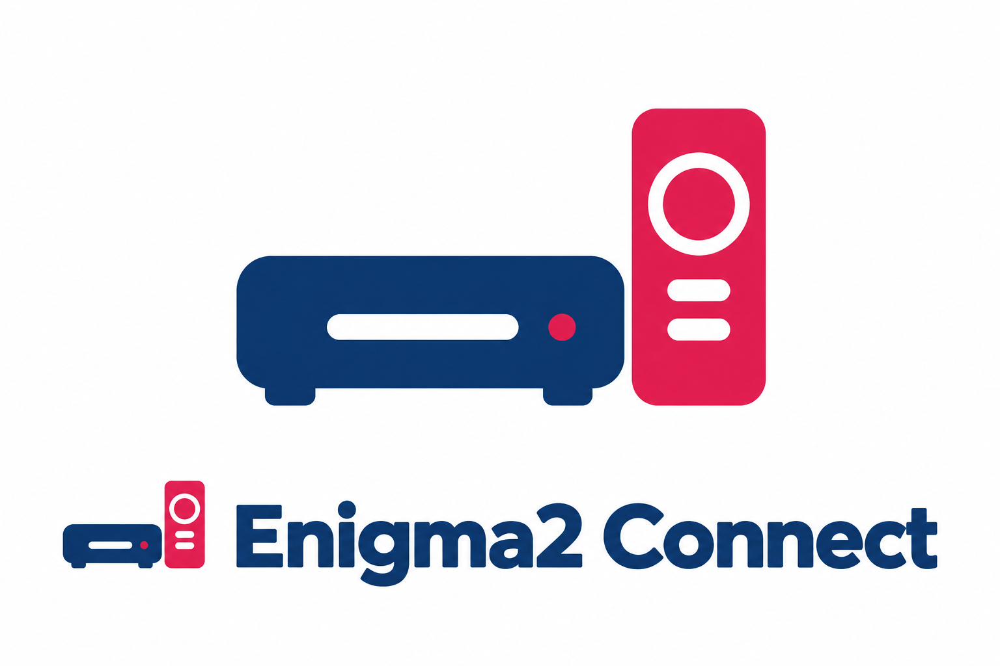
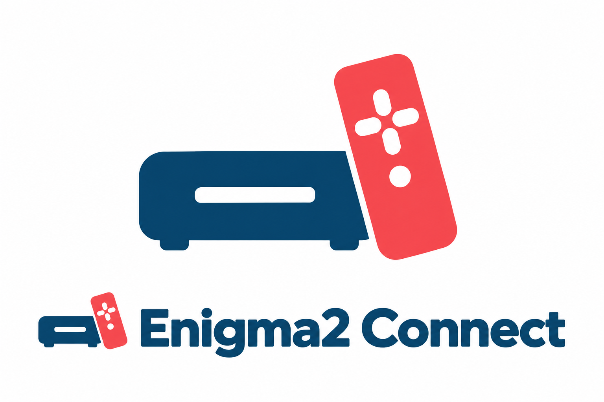
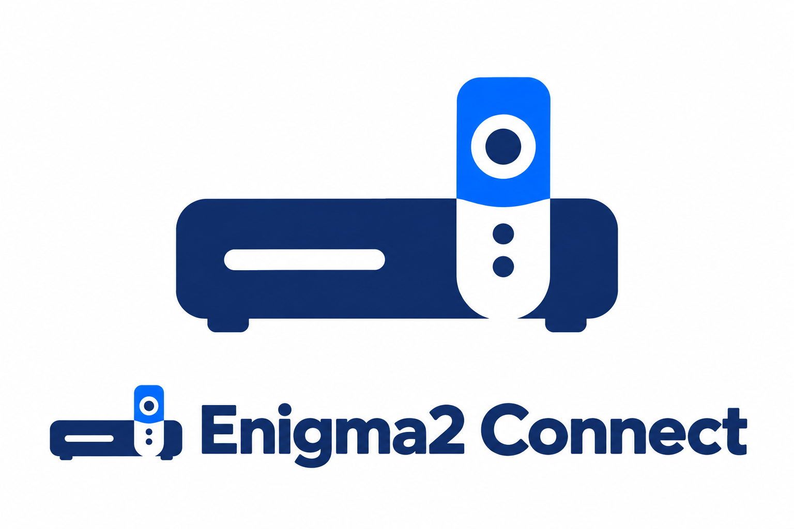

# Enigma2 Connect – Runde 4

Drei Varianten auf Basis von Receiver und Fernbedienung, erstellt mit dem integrierten Imagegen-Tool. Referenz: ../runde-3/02-receiver-remote.png. Entwurfsstand; diese neuen Varianten wurden noch nicht separat auf Ähnlichkeiten geprüft.

## 1. Duo

### Generierungsprompt

Use case: logo-brand. Create ONE polished logo concept presentation for the Home Assistant integration named exactly "Enigma2 Connect". Input image is a REFERENCE for the receiver-and-remote motif and clean friendly simplicity, not an edit target. Evolve it into a distinct variant. White opaque background, flat solid inks, crisp vector-like edges, no texture, no lighting, no glow, no gradients, no shadows, no 3D. Landscape canvas. Large standalone symbol centered in upper two thirds; below it a smaller matching symbol to the left of the exact wordmark "Enigma2 Connect", highly legible modern rounded sans-serif, ample white margins. Receiver must be recognisable as a low set-top-box with two tiny feet, remote as a slender handheld device. Simple deliberate geometry suitable for a tiny app icon. Do not use chains, house outlines, overlapping window logos, TV screen frames, wireless arcs, stock decorative flourishes or brand logos. Text only "Enigma2 Connect". VARIANT 1: Refine the reference into a compact confident duo: deep navy squat receiver with one short white front display slot and a tiny raspberry status dot. Raspberry remote stands vertically to its RIGHT, separated by a narrow white gap, its bottom aligned to the receiver feet. Remote a little taller than receiver, with one white circular navigation ring and two small white horizontal pill buttons below; elegantly balanced, not an oversized towering remote. Preserve the appealing rounded solid silhouette. Navy wordmark.

## 2. Steuerkreuz

### Generierungsprompt

Use case: logo-brand. Create ONE polished logo concept presentation for the Home Assistant integration named exactly "Enigma2 Connect". Input image is a REFERENCE for the receiver-and-remote motif and clean friendly simplicity, not an edit target. Evolve it into a distinct variant. White opaque background, flat solid inks, crisp vector-like edges, no texture, no lighting, no glow, no gradients, no shadows, no 3D. Landscape canvas. Large standalone symbol centered in upper two thirds; below it a smaller matching symbol to the left of the exact wordmark "Enigma2 Connect", highly legible modern rounded sans-serif, ample white margins. Receiver must be recognisable as a low set-top-box with two tiny feet, remote as a slender handheld device. Simple deliberate geometry suitable for a tiny app icon. Do not use chains, house outlines, overlapping window logos, TV screen frames, wireless arcs, stock decorative flourishes or brand logos. Text only "Enigma2 Connect". VARIANT 2: Create a dynamic diagonally composed compact emblem: deep petrol receiver viewed strictly straight-on, with two tiny feet and a short white front display at left. A warm coral remote crosses IN FRONT OF the receiver's right quarter, angled about 25 degrees clockwise from vertical, with a crisp white separation stroke preserving both silhouettes. Remote has a white four-direction plus-shaped navigation key and one white dot below, not a ring. Receiver remains readable and wider than tall. The remote crossing gives the complete symbol a memorable asymmetric shape. Deep petrol wordmark.

## 3. Integriert

### Generierungsprompt

Use case: logo-brand. Create ONE polished logo concept presentation for the Home Assistant integration named exactly "Enigma2 Connect". Input image is a REFERENCE for the receiver-and-remote motif and clean friendly simplicity, not an edit target. Evolve it into a distinct variant. White opaque background, flat solid inks, crisp vector-like edges, no texture, no lighting, no glow, no gradients, no shadows, no 3D. Landscape canvas. Large standalone symbol centered in upper two thirds; below it a smaller matching symbol to the left of the exact wordmark "Enigma2 Connect", highly legible modern rounded sans-serif, ample white margins. Receiver must be recognisable as a low set-top-box with two tiny feet, remote as a slender handheld device. Simple deliberate geometry suitable for a tiny app icon. Do not use chains, house outlines, overlapping window logos, TV screen frames, wireless arcs, stock decorative flourishes or brand logos. Text only "Enigma2 Connect". VARIANT 3: Create a clever quiet geometric emblem with a dark indigo low wide rounded receiver. A white negative-space upright remote silhouette is cut INTO the right third of the receiver and projects ABOVE its top edge as a solid vivid blue remote upper section. This should read as a single integrated receiver-and-remote composition with a clear stepped skyline, never as two windows or a letter logo. Remote navigation uses a small indigo circular button inside a white circular recess in the vivid-blue top portion, and two small indigo dots below in its white lower portion. Receiver has a short white display slot at left and two tiny feet. Limit to indigo, vivid blue and white. Indigo wordmark.

